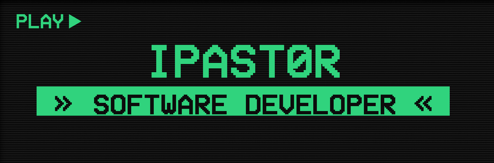

<h1 align="center"> Hello there!, <a href="[https://aristi.dev](https://ipast0r.github.io/pastorghpage/index.html)">Ismael here</a></h1>
 

I'm Ismael Pastor, full stack software developer.
Experienced in designing, creating, maintaining, and testing web and desktop systems.
With well-grounded knowledge in various web, desktop and database management programming languages.
 
<h2 align="center">Tools and Languages</h1>

 
